# Linux Containers
## From the Ground Up

```
$ unshare --mount --pid --uts --net --fork \
    --mount-proc /bin/bash
```

> _"Containers are just Linux processes with extra steps"_

---

## Agenda

| Step  | Topic                  | Key Syscall / Tool         |
| ----- | ---------------------- | -------------------------- |
| **1** | Filesystem Isolation   | `chroot` · `pivot_root`    |
| **2** | Resource Limits        | `cgroups v2`               |
| **3** | Process Isolation      | `unshare --pid`            |
| **4** | Hostname Isolation     | `unshare --uts`            |
| **5** | Network Isolation      | `veth` · `ip netns`        |
| **6** | Packaging with Docker  | `docker build/run/compose` |
| **7** | Daemonless with Podman | `podman build/run/pod`     |

---

## Prereqs and Permission Paths (Fail First, Rootless, Then sudo)

### Copy/paste hygiene (bash)

If you ever see pasted text like `^[[200~...~`, your shell is printing bracketed-paste markers.

```bash
# enable bracketed paste handling in bash/readline
bind 'set enable-bracketed-paste on'
```

### 1) Intentionally fail as normal user

```bash
unshare --mount --pid --uts --net --fork --mount-proc /bin/bash
# expected: Operation not permitted / forbidden
```

Why this fails:
- `--mount`, `--pid`, `--net` require capabilities like `CAP_SYS_ADMIN` and `CAP_NET_ADMIN`
- default user sessions do not have those capabilities in the initial namespace

### 2) Rootless path: prove required permissions are available

```bash
# Requirement A: user namespaces enabled
sysctl user.max_user_namespaces

# Requirement B: network namespaces enabled
sysctl user.max_net_namespaces

# Requirement C: same evidence script for all checks (baseline + each flag)
EVIDENCE='\
echo "PID: $$"; \
echo "UID: $(id -u) ($(id -un))"; \
echo "GID: $(id -g) ($(id -gn))"; \
echo "HOSTNAME: $(hostname)"; \
echo "NS user: $(readlink /proc/self/ns/user)"; \
echo "NS mnt : $(readlink /proc/self/ns/mnt)"; \
echo "NS pid : $(readlink /proc/self/ns/pid)"; \
echo "NS uts : $(readlink /proc/self/ns/uts)"; \
echo "NS net : $(readlink /proc/self/ns/net)"; \
OLD_HOSTNAME="$(hostname)"; \
NEW_HOSTNAME="ns-$$"; \
if hostname "$NEW_HOSTNAME" 2>/dev/null; then \
  echo "SET HOSTNAME: OK (${OLD_HOSTNAME} -> $(hostname))"; \
else \
  echo "SET HOSTNAME: FAIL (insufficient privileges in this namespace)"; \
fi; \
hostname "$OLD_HOSTNAME" 2>/dev/null || true; \
echo "PID 1 comm: $(tr -d "\\0" </proc/1/comm 2>/dev/null || echo n/a)"; \
echo "MOUNT TEST:"; \
mkdir -p /tmp/ns-mnt-test; \
if mount -t tmpfs tmpfs /tmp/ns-mnt-test 2>/dev/null; then \
  echo "mount tmpfs: OK"; \
  grep -m1 " /tmp/ns-mnt-test " /proc/self/mountinfo || true; \
  umount /tmp/ns-mnt-test 2>/dev/null || true; \
else \
  echo "mount tmpfs: FAIL"; \
fi; \
rmdir /tmp/ns-mnt-test 2>/dev/null || true; \
echo "IFACES:"; ip -br a 2>/dev/null || true'

echo "==== baseline (host shell) ===="
sh -c "$EVIDENCE"

echo "==== with --user only ===="
unshare --user --map-root-user --fork sh -c "$EVIDENCE"

echo "==== with --user + --mount ===="
unshare --user --map-root-user --mount --fork sh -c "$EVIDENCE"

echo "==== with --user + --pid ===="
unshare --user --map-root-user --pid --fork sh -c "$EVIDENCE"

echo "==== with --user + --uts ===="
unshare --user --map-root-user --uts --fork sh -c "$EVIDENCE"

echo "==== with --user + --net ===="
unshare --user --map-root-user --net --fork sh -c "$EVIDENCE"

# Final check: all flags at the same time
echo "==== with --user + --mount + --pid + --uts + --net ===="
unshare --user --map-root-user --mount --pid --uts --net --fork --mount-proc sh -c "$EVIDENCE"
```

What these sysctls mean:
- `user.max_user_namespaces`: maximum number of user namespaces that can exist on the host
- `user.max_net_namespaces`: maximum number of network namespaces that can exist on the host

About the unshare flags above:
- `--user`: create a new user namespace (separate UID/GID mapping and capabilities scope)
- `--map-root-user`: map your current host user to UID 0/GID 0 inside that user namespace
- `--fork`: run the target command as a child created after unshare; useful for predictable PID semantics and the common pattern when combining namespaces

Do we need `--fork`?
- for this simple one-shot check, not strictly required
- recommended in demos because many namespace examples (especially PID namespace flows) rely on a child process model, so behavior is clearer and consistent

What they allow in practice:
- non-zero `user.max_user_namespaces` allows `unshare --user --map-root-user` for rootless setups
- non-zero `user.max_net_namespaces` allows creating isolated network stacks (`unshare --net`)

What goes wrong if they are not set correctly:
- value `0` blocks creation of that namespace type (`Operation not permitted` / `No space left on device`)
- rootless demos and rootless engines (Podman/Docker rootless) fail to start isolated containers
- if the key is missing entirely, the kernel may not expose that control path; rely on direct `unshare --user ...` tests

Expected evidence on this host:
- `user.max_user_namespaces` and `user.max_net_namespaces` are non-zero
- in `--user` checks, UID/GID become `0 (root)` while host remains your normal user
- in `--mount`, `NS mnt` differs from baseline and `mount tmpfs: OK`
- in `--pid`, the shell PID is namespace-local and `PID 1 comm` changes to your init process for that namespace
- in `--uts`, `NS uts` differs from baseline and `SET HOSTNAME: OK (...)` appears
- in `--net`, `NS net` differs from baseline and interfaces are namespace-local (typically only `lo`)
- in the final all-flags check, `NS mnt/pid/uts/net` all differ from baseline, PID is typically `1`, mount test is `OK`, and interfaces are namespace-local

### 3) Rootless command (works without sudo)

```bash
# clean interactive shell inside namespace (ignores ~/.bashrc, /etc/bashrc)
unshare --user --map-root-user --mount --pid --uts --net --fork --mount-proc /bin/bash --noprofile --norc
```

---

## What IS a Container?

No magic. No hypervisor. No new kernel.

```
Process A               Process B  ← "container"
    │                       │
    └──── same kernel ───────┘
               │
         Linux Namespaces  →  isolation
         cgroups           →  limits
         seccomp / caps    →  security
         rootfs (overlay)  →  filesystem
```

A container is a **process** that _believes_ it is alone.

---

# Step 1
## Filesystem Isolation

```text
Phase 1 (chroot only)
chroot rootfs
   -> sees remapped /
   -> host kernel still shared
```

```text
Phase 2 (real container-style root switch)
unshare --mount
   -> pivot_root
   -> old root unmounted
```

```
📁  /  (host)
 └── 📁 rootfs/   ← our "container root"
      ├── bin/
      ├── etc/
      ├── proc/
      └── ...
```

**Goal:** make a process see a _different_ `/`

---

## Step 1 — The Old Way: `chroot`

`chroot` has been in Unix since **1979** (Version 7 AT&T Unix)

```bash
# download a minimal Alpine Linux root filesystem
curl -Lo alpine.tar.gz \
  https://dl-cdn.alpinelinux.org/alpine/v3.19/releases/x86_64/\
alpine-minirootfs-3.19.1-x86_64.tar.gz

mkdir rootfs && tar -xzf alpine.tar.gz -C rootfs/

# step into it
chroot rootfs /bin/sh
```

Inside:
```sh
ls /          # Alpine's /
cat /etc/os-release   # Alpine!
hostname              # same as host ← not isolated yet
```

---

## Step 1 — The Problem with `chroot`

```
chroot process
    │
    ├── sees /rootfs as /       ✅ filesystem isolated
    ├── shares host /proc       ⚠️  sees ALL host pids
    ├── shares host hostname    ⚠️  not isolated
    ├── shares host network     ⚠️  not isolated
    └── shares host PID space   ⚠️  not isolated
```

> `chroot` is just a **directory trick** — the process still shares everything else with the host.

---

## Step 1 — The Right Way: `pivot_root`

```bash
# create a new mount namespace first
unshare --mount bash

# bind-mount rootfs on itself (pivot_root requires a mount point)
mount --bind rootfs/ rootfs/

# create a place to stash the old root
mkdir -p rootfs/.oldroot

# switch the root
cd rootfs/
pivot_root . .oldroot

# tidy up
mount -t proc proc /proc
umount -l /.oldroot
```

Now `ls /` shows **only** the Alpine rootfs — not just a chdir trick.

---

## Step 1 — `chroot` vs `pivot_root`

|         | `chroot`                | `pivot_root`               |
| ------- | ----------------------- | -------------------------- |
| Since   | Unix V7 (1979)          | Linux 2.3.41 (2000)        |
| How     | `chdir` + restrict `..` | changes actual mount point |
| Escape  | Trivial as root         | Hard — old root unmounted  |
| Used by | Legacy tools, LXC       | Docker, containerd, runc   |
| Needs   | Nothing                 | New mount namespace        |

---

# Step 2
## Resource Limits with cgroups

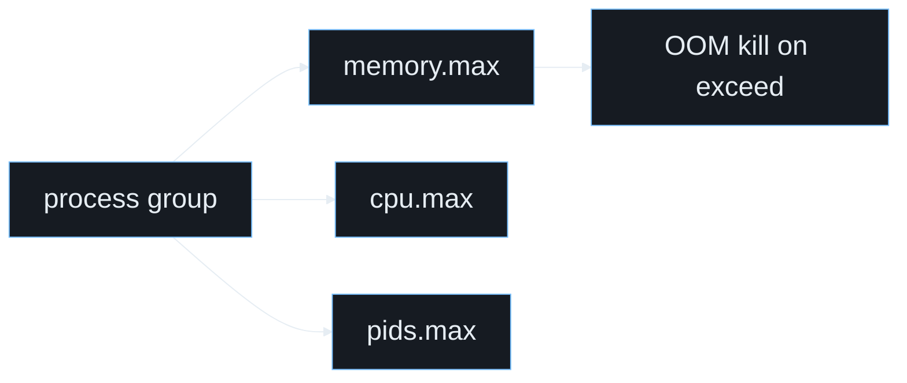

```
/sys/fs/cgroup/
 └── containers/
      └── mycontainer/
           ├── memory.max       ← 64M
           ├── memory.current   ← 12M
           └── cgroup.procs     ← 1337
```

**Goal:** prevent a process from consuming unlimited resources

---

## Step 2 — cgroups v2

Control Groups = **kernel accounting + enforcement** per process group

```bash
# check if cgroups v2 is active
mount | grep cgroup2
# cgroup2 on /sys/fs/cgroup type cgroup2 ...

# create a new cgroup slice
mkdir /sys/fs/cgroup/demo

# set a 64 MiB memory limit
echo $((64 * 1024 * 1024)) > /sys/fs/cgroup/demo/memory.max

# enable OOM killer (don't just throttle)
echo 1 > /sys/fs/cgroup/demo/memory.oom.group

# attach current shell to the cgroup
echo $$ > /sys/fs/cgroup/demo/cgroup.procs
```

---

## Step 2 — Watching the OOM Killer

```bash
# inside cgroup-constrained shell:

# check current memory usage
cat /sys/fs/cgroup/demo/memory.current

# try to allocate more than 64 MiB with Python
python3 -c "x = bytearray(100 * 1024 * 1024)"
# Killed  ← OOM killer strikes!

# host kernel log shows the kill
dmesg | tail -5
# [  123.456] Memory cgroup out of memory: Kill process ...
```

> The kernel killed the process. The host didn't even blink.

---

## Step 2 — Other cgroup Controllers

```bash
# CPU: limit to 50% of one core (period = 100ms, quota = 50ms)
echo "50000 100000" > /sys/fs/cgroup/demo/cpu.max

# PIDs: max 10 processes
echo 10 > /sys/fs/cgroup/demo/pids.max

# check all active controllers
cat /sys/fs/cgroup/demo/cgroup.controllers
# cpuset cpu io memory hugetlb pids rdma
```

**cgroups answer:** _"How much?"_  
**Namespaces answer:** _"What can you see?"_

---

# Step 3
## Process Isolation — PID Namespace

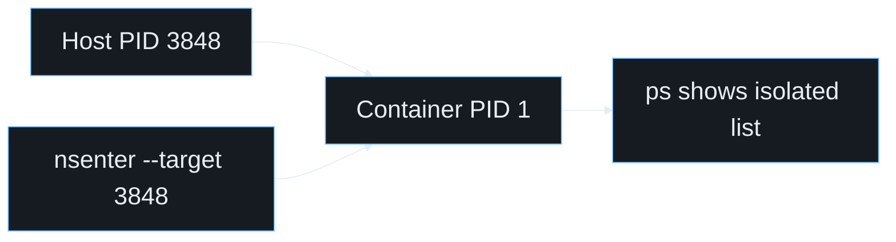

```
Host PID space            Container PID space
──────────────            ───────────────────
  PID 1 systemd             PID 1 ← /bin/sh  (same process!)
  PID 2 kthreadd            PID 2 ← child
  ...
  PID 3847 bash
  PID 3848 our-container-sh
```

**Goal:** the container sees itself as PID 1

---

## Step 3 — `unshare --pid`

```bash
# new PID namespace + new mount namespace for /proc
unshare --pid --fork --mount-proc bash

# inside — check our PID
echo $$          # 1 !

# check what processes we see
ps aux
# PID  CMD
#   1  bash
#   6  ps aux

# we ARE PID 1. Nothing else visible.
```

From **another terminal** on the host:

```bash
# the process exists on the host with its real PID
ps aux | grep bash    # PID 3848
# Enter the namespace from outside:
nsenter --pid --target 3848 -- ps aux
```

---

## Step 3 — `nsenter`

`nsenter` lets you **join an existing namespace** — the operator's swiss army knife.

```bash
# find the "container" PID on the host
CPID=$(pidof unshare)

# enter ONLY the PID namespace, keeping your own terminal
nsenter --pid=/proc/$CPID/ns/pid --target $CPID -- ps aux

# enter ALL namespaces (like docker exec)
nsenter --target $CPID \
        --mount --pid --uts --net \
        -- /bin/sh
```

> This is literally what `docker exec` does under the hood.

---

# Step 4
## UTS Namespace — Hostname & Domain

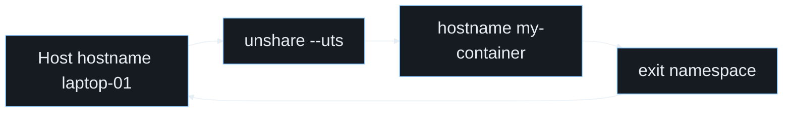

```
Host:                     Container:
  hostname = laptop-01      hostname = my-container
  domainname = local        domainname = cluster.local
```

**UTS** = _UNIX Time-sharing System_ — just the namespace that holds hostname and NIS domain name.

---

## Step 4 — `unshare --uts`

```bash
# create a UTS namespace
unshare --uts bash

# check hostname (same as host right now)
hostname          # laptop-01

# change it — only affects THIS namespace
hostname my-container
hostname          # my-container

# exit and check host
exit
hostname          # laptop-01 ← unchanged!
```

Now combine it with what we built before:

```bash
unshare --mount --pid --uts --fork --mount-proc bash
hostname my-alpine
# + pivot_root into Alpine rootfs
```

---

## Step 4 — Composing Namespaces

Each `unshare` flag adds one layer of isolation:

```
unshare \
  --mount        # ← Step 1: own filesystem view
  --pid          # ← Step 3: own PID space (PID 1!)
  --uts          # ← Step 4: own hostname
  --fork         # fork so child gets the new PID ns
  --mount-proc   # remount /proc for the new PID ns
  /bin/bash
```

We now have a process that:
- Boots into its own root filesystem
- Believes it is PID 1
- Has its own hostname
- Is constrained by a cgroup

**It's starting to look like a container.**

---

# Step 5
## Network Isolation — veth Pairs

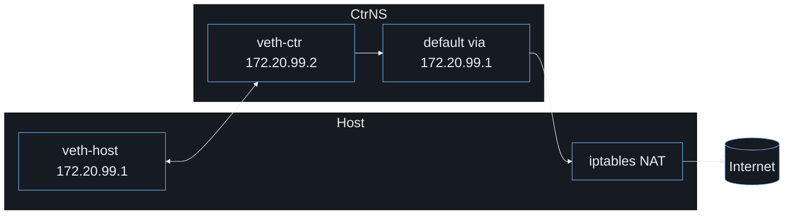

```
  HOST namespace          CONTAINER namespace
  ──────────────          ───────────────────
  eth0  172.20.0.1 ──┐   ┌── eth0  172.20.0.2
                      │   │
                    [veth0]─[veth1]
                      virtual ethernet pair
                         (like a pipe)
```

**Goal:** give the container its own network stack, then connect it to the host.

---

## Step 5 — Network Namespace + veth

```bash
# 1. create a named network namespace
ip netns add mycontainer

# 2. create a veth pair (two virtual NICs linked together)
ip link add veth0 type veth peer name veth1

# 3. move one end into the container namespace
ip link set veth1 netns mycontainer

# 4. configure the HOST end
ip addr add 172.20.0.1/24 dev veth0
ip link set veth0 up

# 5. configure the CONTAINER end
ip netns exec mycontainer ip addr add 172.20.0.2/24 dev veth1
ip netns exec mycontainer ip link set veth1 up
ip netns exec mycontainer ip link set lo up
```

---

## Step 5 — Ping Through the veth Pair

```bash
# host pings container
ping -c 3 172.20.0.2

# container pings host
ip netns exec mycontainer ping -c 3 172.20.0.1

# enter the namespace interactively
ip netns exec mycontainer bash

# inside: own network stack
ip addr show      # only lo and veth1
ip route show     # only 172.20.0.0/24
```

---

## Step 5 — Connecting to the Outside World

```bash
# enable IP forwarding on the host
echo 1 > /proc/sys/net/ipv4/ip_forward

# NAT outbound traffic from container subnet
iptables -t nat -A POSTROUTING \
         -s 172.20.0.0/24 ! -o veth0 \
         -j MASQUERADE

# add default route inside container
ip netns exec mycontainer \
  ip route add default via 172.20.0.1

# test internet access from container
ip netns exec mycontainer ping -c 2 8.8.8.8
```

> This is the foundation of Docker's `docker0` bridge!

---

## Step 5 — Combining Everything

```bash
# The "full container" command (no OCI runtime, raw Linux):

ip netns add mycontainer

unshare --mount --pid --uts --net --fork bash <<'EOF'
  # move into network namespace  
  ip netns exec mycontainer bash
  
  # set hostname
  hostname my-alpine
  
  # pivot into alpine rootfs
  mount --bind /path/to/rootfs /path/to/rootfs
  cd /path/to/rootfs && pivot_root . .oldroot
  mount -t proc proc /proc
  umount -l /.oldroot

  exec /bin/sh
EOF
```

---

# Step 6
## Docker — Packaging the Primitive Stack

Docker adds:
- Image format (OCI image)
- Runtime management (`containerd` + `runc`)
- Networking defaults (bridge + NAT)
- Multi-service workflow (`compose`)

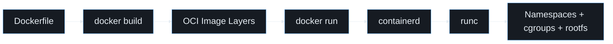

---

## Step 6.1 — Docker Build

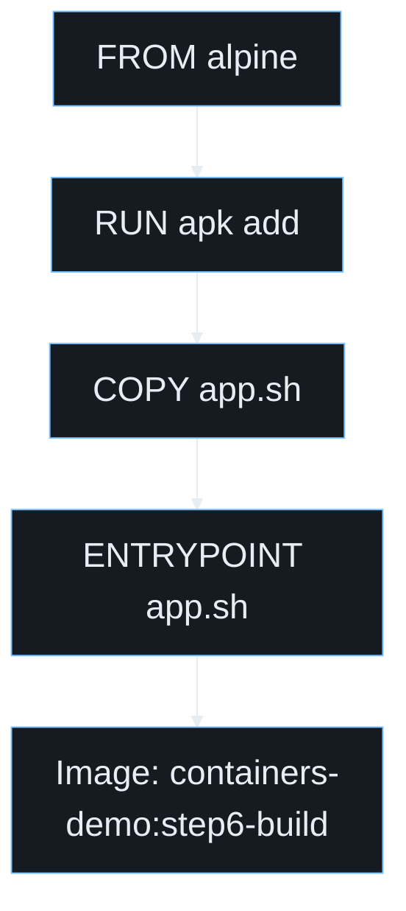

```bash
cd 6-docker/1-build
./demo.sh
```

What to highlight live:
- `Dockerfile` instructions become layers
- Immutable layers + writable container layer
- `docker history` reveals layer lineage

---

## Step 6.2 — Docker Run

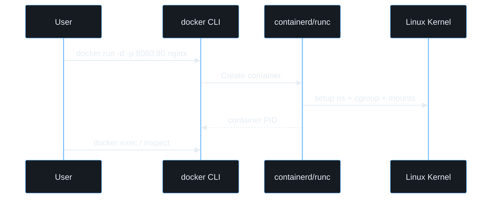

```bash
cd 6-docker/2-run
./demo.sh
```

Demo points:
- Lifecycle: create, start, exec, inspect, remove
- Port publishing: `-p host:container`
- Runtime state: container PID maps to host PID

---

## Step 6.3 — Docker Compose

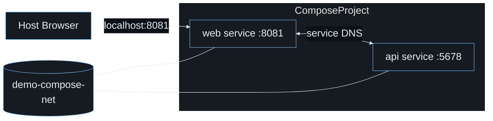

```bash
cd 6-docker/3-compose
./demo.sh
```

Demo points:
- One YAML defines services + network + volumes
- Internal DNS by service name (`demo-api`)
- `up` and `down` orchestrate the stack

---

# Step 7
## Podman — Daemonless Containers and Pods

Podman focuses on:
- Daemonless operation (no central root daemon)
- Rootless workflows by default
- Pod abstraction aligned with Kubernetes

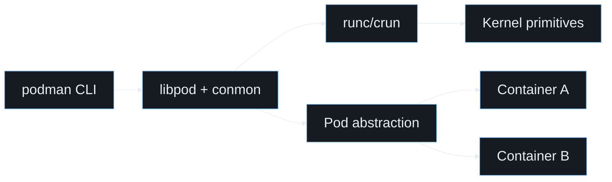

---

## Step 7.1 — Podman Build

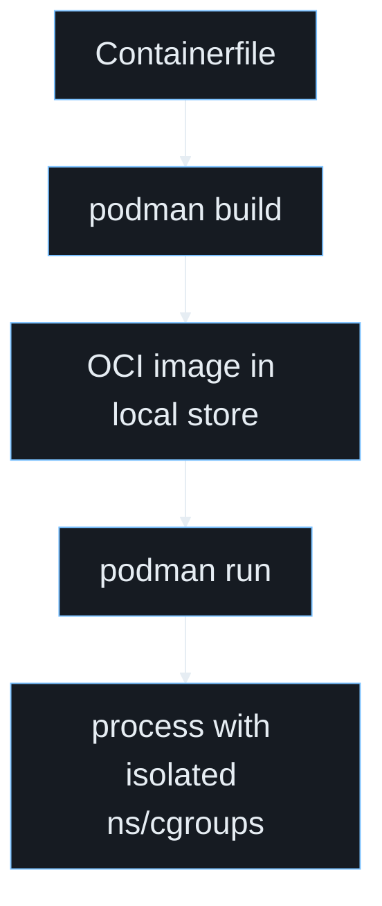

```bash
cd 7-podman/1-build
./demo.sh
```

Demo points:
- `Containerfile` syntax compatible with Dockerfile
- Build and run with no daemon process
- Layer inspection with `podman history`

---

## Step 7.2 — Podman Run

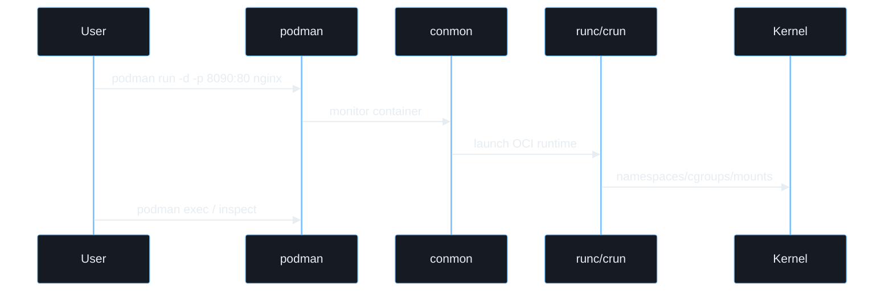

```bash
cd 7-podman/2-run
./demo.sh
```

Demo points:
- Similar UX to Docker for run/exec/inspect
- Better rootless story for local development
- No daemon restart dependency

---

## Step 7.3 — Podman Pods

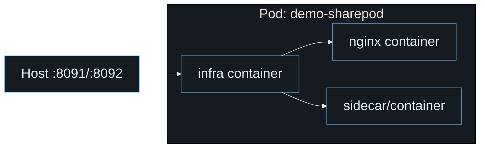

```bash
cd 7-podman/3-pods
./demo.sh
```

Demo points:
- Multiple containers share one pod network namespace
- Pod lifecycle commands (`pod create`, `pod ps`)
- Kubernetes bridge (`generate kube`, `play kube`)

---

## What We Built — Layer by Layer

```
┌─────────────────────────────────────────────┐
│  Container Process (/bin/sh as PID 1)        │
├─────────────────────────────────────────────┤
│  Step 4: UTS ns  → hostname = "my-alpine"   │
│  Step 3: PID ns  → sees only itself          │
│  Step 5: Net ns  → veth1 / 172.20.0.2       │
│  Step 1: Mnt ns  → pivot_root → Alpine /    │
├─────────────────────────────────────────────┤
│  Step 2: cgroup  → max 64 MiB RAM, 50% CPU  │
├─────────────────────────────────────────────┤
│              Linux Kernel                    │
└─────────────────────────────────────────────┘
```

No Docker. No containerd. Just **syscalls and kernel features**.

---

## What We Cover Next in Live Demos

| Topic                             | Where                   |
| --------------------------------- | ----------------------- |
| Image layers (overlay filesystem) | Step 6.1 - Docker build |
| OCI runtime flow                  | Step 6.2 - Docker run   |
| Multi-service orchestration       | Step 6.3 - Compose      |
| Daemonless containers             | Step 7.2 - Podman run   |
| Pod model + Kubernetes bridge     | Step 7.3 - Podman pods  |

---

## Key Takeaways

- **Namespaces** = _what you can see_ (mount, pid, uts, net, ipc, user)
- **cgroups** = _how much you can use_ (cpu, memory, pids, io)
- **`unshare`** = create new namespaces and run a command in them
- **`nsenter`** = join existing namespaces (the `docker exec` trick)
- **`pivot_root`** = proper root filesystem switch (stronger than chroot)
- **`veth`** = virtual ethernet cable between namespaces

> Docker, Podman, LXC, containerd — **they are all wrappers around these primitives**.

---

# Demo Time!

```
📁 1-fs/     → filesystem isolation
📁 2-mem/    → cgroup memory limits
📁 3-proc/   → PID namespace
📁 4-uts/    → UTS namespace
📁 5-net/    → veth networking
📁 6-docker/ → build, run, compose
📁 7-podman/ → build, run, pods
```

```bash
./run-demo.sh 1
./run-demo.sh 2
./run-demo.sh 3
./run-demo.sh 4
./run-demo.sh 5
./run-demo.sh 6.1
./run-demo.sh 6.2
./run-demo.sh 6.3
./run-demo.sh 7.1
./run-demo.sh 7.2
./run-demo.sh 7.3
```
